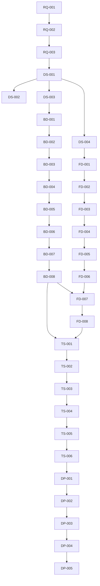

# 无人船虚拟仿真系统任务分解计划

## 1. 项目概述

本任务分解计划基于《无人船虚拟仿真系统开发计划》，将项目任务分解为具体的可执行任务，并分配给相应的agent进行开发。

## 2. 团队组成

| Agent ID | 角色 | 职责 |
|---------|------|------|
| A1 | 后端开发1 | 后端功能开发和维护 |
| A2 | 后端开发2 | 后端功能开发和维护 |
| A3 | 前端开发1 | 前端页面开发和交互 |
| A4 | 前端开发2 | 前端页面开发和交互 |
| A5 | 测试工程师 | 系统测试和质量保证 |
| A6 | 项目经理 | 项目规划、协调和管理 |

## 3. 任务分解与分配

### 3.1 需求分析阶段（第1周）

| 任务ID | 任务名称 | 描述 | 负责人 | 工期 | 依赖 |
|--------|---------|------|--------|------|------|
| RQ-001 | 详细需求分析 | 分析无人船虚拟仿真系统的详细需求 | A6 | 3天 | 无 |
| RQ-002 | 功能边界确定 | 确定系统的功能边界和范围 | A6 | 2天 | RQ-001 |
| RQ-003 | 需求文档编写 | 编写详细的需求文档 | A6 | 2天 | RQ-002 |

### 3.2 设计阶段（第2周）

| 任务ID | 任务名称 | 描述 | 负责人 | 工期 | 依赖 |
|--------|---------|------|--------|------|------|
| DS-001 | 系统架构设计 | 设计系统的整体架构 | A1, A2 | 2天 | RQ-003 |
| DS-002 | 数据库设计 | 设计数据库表结构和关联关系 | A1 | 2天 | DS-001 |
| DS-003 | 接口设计 | 设计前后端接口规范 | A2 | 2天 | DS-001 |
| DS-004 | 前端架构设计 | 设计前端系统架构 | A3, A4 | 2天 | DS-001 |

### 3.3 开发阶段（第3-6周）

#### 3.3.1 后端开发

| 任务ID | 任务名称 | 描述 | 负责人 | 工期 | 依赖 |
|--------|---------|------|--------|------|------|
| BD-001 | 无人机场管理API | 实现无人机场管理的完整CRUD接口 | A1 | 3天 | DS-003 |
| BD-002 | 无人船管理API | 开发无人船管理的CRUD接口 | A1 | 3天 | BD-001 |
| BD-003 | 仿真场景管理API | 开发仿真场景管理的CRUD接口 | A2 | 3天 | DS-003 |
| BD-004 | 任务管理API | 开发任务管理的CRUD接口 | A2 | 3天 | BD-003 |
| BD-005 | 仿真算法实现 | 实现无人船仿真算法 | A1 | 5天 | BD-004 |
| BD-006 | 任务调度逻辑 | 实现任务调度和执行逻辑 | A2 | 5天 | BD-005 |
| BD-007 | 数据分析功能 | 实现仿真数据的统计和分析功能 | A1 | 3天 | BD-006 |
| BD-008 | 后端集成测试 | 测试后端接口和业务逻辑 | A1, A2 | 2天 | BD-007 |

#### 3.3.2 前端开发

| 任务ID | 任务名称 | 描述 | 负责人 | 工期 | 依赖 |
|--------|---------|------|--------|------|------|
| FD-001 | 无人机场管理页面 | 完善无人机场管理页面 | A3 | 3天 | DS-004 |
| FD-002 | 无人船管理页面 | 开发无人船管理页面 | A3 | 3天 | FD-001 |
| FD-003 | 仿真场景管理页面 | 开发仿真场景管理页面 | A4 | 3天 | DS-004 |
| FD-004 | 任务管理页面 | 开发任务管理页面 | A4 | 3天 | FD-003 |
| FD-005 | 数据分析页面 | 开发数据分析页面 | A3 | 3天 | FD-004 |
| FD-006 | 页面交互逻辑 | 实现页面的交互逻辑 | A3, A4 | 4天 | FD-005 |
| FD-007 | API集成 | 集成后端API接口 | A3, A4 | 3天 | BD-008, FD-006 |
| FD-008 | 前端测试 | 测试前端页面和功能 | A3, A4 | 2天 | FD-007 |

### 3.4 测试阶段（第7周）

| 任务ID | 任务名称 | 描述 | 负责人 | 工期 | 依赖 |
|--------|---------|------|--------|------|------|
| TS-001 | 单元测试 | 编写和执行单元测试 | A5 | 2天 | BD-008, FD-008 |
| TS-002 | 集成测试 | 测试系统各模块的集成 | A5 | 2天 | TS-001 |
| TS-003 | 端到端测试 | 测试完整的业务流程 | A5 | 2天 | TS-002 |
| TS-004 | 性能测试 | 进行压力测试和负载测试 | A5 | 1天 | TS-003 |
| TS-005 | 安全测试 | 进行权限测试和漏洞扫描 | A5 | 1天 | TS-004 |
| TS-006 | 测试报告编写 | 编写详细的测试报告 | A5 | 1天 | TS-005 |

### 3.5 部署阶段（第8周）

| 任务ID | 任务名称 | 描述 | 负责人 | 工期 | 依赖 |
|--------|---------|------|--------|------|------|
| DP-001 | 环境配置 | 配置生产环境和测试环境 | A6 | 2天 | TS-006 |
| DP-002 | 系统部署 | 部署后端服务和前端应用 | A1, A3 | 2天 | DP-001 |
| DP-003 | 监控配置 | 配置系统监控和告警 | A2 | 2天 | DP-002 |
| DP-004 | 部署测试 | 测试部署后的系统功能 | A5 | 1天 | DP-003 |
| DP-005 | 上线准备 | 准备系统上线文档和培训材料 | A6 | 1天 | DP-004 |

## 4. 任务依赖关系

## 5. 时间计划

| 阶段 | 时间 | 任务数量 |
|------|------|----------|
| 需求分析 | 第1周 | 3个任务 |
| 设计阶段 | 第2周 | 4个任务 |
| 开发阶段 | 第3-6周 | 16个任务 |
| 测试阶段 | 第7周 | 6个任务 |
| 部署阶段 | 第8周 | 5个任务 |

## 6. 关键里程碑

| 里程碑 | 时间 | 完成标准 |
|--------|------|----------|
| 需求分析完成 | 第1周末 | 需求文档编写完成 |
| 设计阶段完成 | 第2周末 | 系统设计、数据库设计、接口设计完成 |
| 后端开发完成 | 第5周末 | 所有后端API和业务逻辑实现完成 |
| 前端开发完成 | 第6周末 | 所有前端页面和功能实现完成 |
| 测试完成 | 第7周末 | 测试报告编写完成 |
| 系统上线 | 第8周末 | 系统部署完成并正常运行 |

## 7. 风险管理

| 风险 | 影响程度 | 可能性 | 应对措施 | 负责人 |
|------|---------|--------|----------|--------|
| 需求变更 | 中 | 高 | 建立需求变更管理流程，定期与用户沟通 | A6 |
| 技术挑战 | 中 | 中 | 提前进行技术调研，储备技术方案 | A1, A3 |
| 时间压力 | 高 | 中 | 合理规划开发周期，优先级排序 | A6 |
| 资源不足 | 中 | 中 | 合理分配资源，确保关键任务有足够人力 | A6 |

## 8. 质量保证

| 措施 | 描述 | 负责人 |
|------|------|--------|
| 代码规范 | 遵循项目编码规范 | 所有开发人员 |
| 代码审查 | 定期进行代码审查 | A1, A3 |
| 测试覆盖 | 确保测试覆盖率达到80%以上 | A5 |
| 文档完善 | 及时更新技术文档和用户文档 | 所有开发人员 |

## 9. 沟通机制

| 沟通方式 | 频率 | 参与人员 | 负责人 |
|----------|------|----------|--------|
| 每日站会 | 每天15分钟 | 所有团队成员 | A6 |
| 周例会 | 每周1小时 | 所有团队成员 | A6 |
| 技术评审 | 每两周1小时 | 开发人员 | A1, A3 |
| 进度报告 | 每周 | 所有团队成员 | A6 |

## 10. 交付物

| 交付物 | 描述 | 负责人 | 交付时间 |
|--------|------|--------|----------|
| 需求文档 | 详细的系统需求文档 | A6 | 第1周末 |
| 设计文档 | 系统设计、数据库设计、接口设计文档 | A1, A2, A3, A4 | 第2周末 |
| 后端代码 | 完整的后端服务代码 | A1, A2 | 第5周末 |
| 前端代码 | 完整的前端应用代码 | A3, A4 | 第6周末 |
| 测试报告 | 详细的测试报告 | A5 | 第7周末 |
| 部署文档 | 系统部署和配置文档 | A6 | 第8周末 |
| 用户手册 | 系统使用手册 | A6 | 第8周末 |
